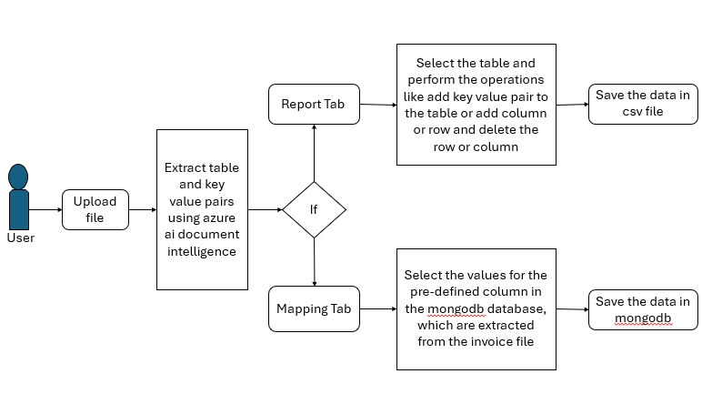

# Invoice Extraction

## Project Overview
The Invoice Extraction Project automates data extraction from invoices using Microsoft Azure AI Document Intelligence, storing structured information in MongoDB. It features two main sections: Reports and Mapping Rules. In Reports, users view extracted data in a table, where they can add, remove, or modify rows and columns, and download it as a CSV. In Mapping Rules, users map data to predefined columns in MongoDB, making it ready for Power BI visualization. This project streamlines data handling, reducing manual effort and errors while enabling powerful insights from invoices for efficient business decision-making.


## Table of Contents

- [Introduction](#introduction)
- [Architecture Diagram](#architecture-diagram)
- [Features](#features)
- [Technology Stack](#technology-stack)
- [Installation](#installation)
- [Configuration](#configuration)
- [Usage](#usage)
- [File Structure](#file-structure)
- [Troubleshooting](#troubleshooting)


## Introduction

The Invoice Extraction Project is a Django-based web application that leverages Microsoft Azure AI Document Intelligence to process and extract data from invoices. This data is structured into a table format with key-value pairs that can be manipulated by the user. The extracted information is stored in MongoDB, enabling further visualization in Power BI.

## Architecture Diagram

Below is an overview of the architecture of the Invoice Extraction:



## Features

- AI-Based Document Intelligence: Extract tables and key-value pairs from invoices.

- Drag-and-drop file upload or browse functionality.

- View and manage extracted data in a table format.

- Add or delete rows and columns.

- Download the data as a CSV file.

- Simple, user-friendly interface using Bootstrap for styling.

- Map extracted data to predefined columns in MongoDB.

- Store mapped data for further visualization in Power BI.

## Technology Stack

- **Backend**: Django (Python)
- **Frontend**: Bootstrap (HTML, CSS, JavaScript)
- **Database**: MongoDB
- **Other**: Microsoft Azure AI Document Intelligence for data extraction

## Installation

### Prerequisites

- Python 3.11
- Django 5.0.7
- AI Document Intelligence Subscription

### Step-by-Step Guide

1. **Clone the Repository**:
   ```bash
   git clone https://github.com/AZONES-TECHNOLOGIES/Invoice_Extraction.git
   cd Invoice_Extraction
   ```

2. **Create a Virtual Environment**:
    ```bash
    python3 -m venv venv
   venv\Scripts\activate  # On Windows use 
    ```

3. **Install the Required Python Packages**:
    ```bash
    pip install -r requirements.txt
    ```

4. **Environment Variables**:
   - Create a `.env` file in the root directory.
   - Add the following environment variables:
    ```
    endpoint=your_azure_ai_document_intelligence_endpoint
    key=your_azure_ai_document_intelligence_key
    ```
5. **Set up MongoDB**:
- Install and configure MongoDB on your machine.
- Create a database (e.g., invoice_db) to store extracted data and mapping information.

6. **Navigate to the working directory**:
    ```bash
    cd invoice     
    ```    

7. **Start the Development Server**:
    ```bash
    python manage.py runserver
    ```

## Configuration

- **Database Configuration**: Configure MongoDB connection details to connect the Django application to MongoDB.

- **AI Document Intelligence Integration**: Ensure your AI document intelligence model is accessible and configure necessary API keys or endpoints.

## Usage

1. Navigate to the application in your browser:
- Open `http://127.0.0.1:8000` in your web browser.
2. Upload a file:
- Use the drag-and-drop area or browse button to upload your file.
3. Report Tab:
- Upload invoice documents to extract data.
- Review the extracted data displayed in a table format.
- Use the options to add or delete rows and columns.
- Download the edited data as a CSV file.
4. Mapping Rules Tab:
- View predefined columns from MongoDB.
- Map extracted values to the predefined columns.
- Save the mappings, making the data ready for visualization in Power BI.

## File Structure

```plaintext
Invoice Extraction/
├── .env               # Environment variables
├── venv               # Virtual Environment
├── requirements.txt   # Python dependencies
├── README.md          # Project README
├── invoice/
    │
    ├── app/                   # Main Django app
    │   ├── __pycache__/
    │   ├── migrations/
    │   ├── __init__.py
    │   ├── admin.py
    │   ├── apps.py
    │   ├── models.py
    │   ├── tests.py
    │   ├── urls.py
    │   ├── views.py            # Django views handling logic
    |   
    │
    ├── static/                 # Static files (CSS, JS, images)
    │   ├── css/
    │   ├── js/
    │
    ├── templates/              # HTML template for the invoice interface
    │   ├── upload.html         
    │
    ├── invoice/               
    │   ├── __pycache__/
    │   ├── __init__.py
    │   ├── asgi.py
    │   ├── settings.py
    │   ├── urls.py
    │   ├── wsgi.py         
    |
    ├── manage.py               # Django project management script
    └── ...
```
## Troubleshooting
**API Key Issues**: Ensure the API key and endpoint are correctly set in the `.env` file.

**MongoDB Connection Issues**: Ensure MongoDB is running and check the connection details.
